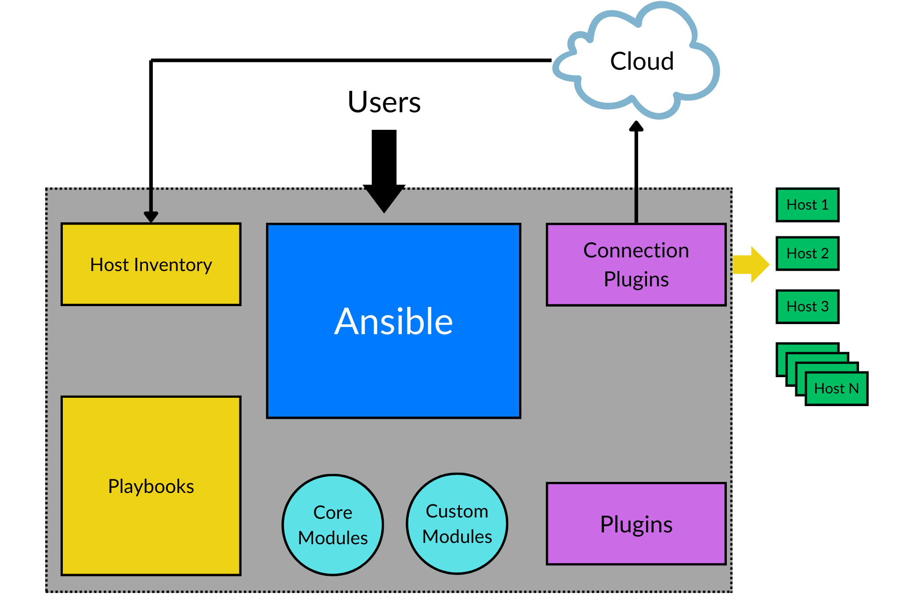
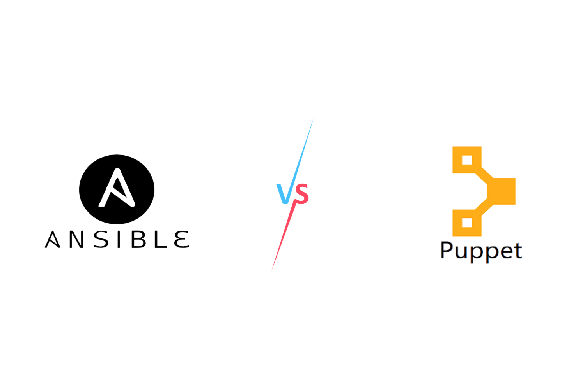
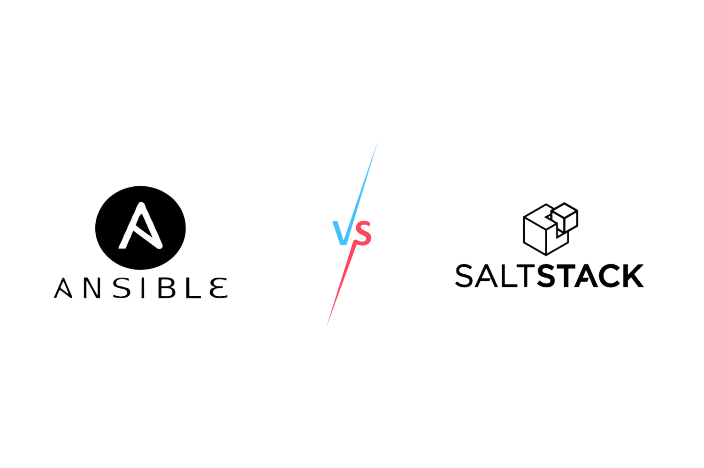

# 2. Обзор Ansible

## 2.1 Что такое Ansible?

Ansible — это инструмент автоматизации ИТ с открытым исходным кодом.

Ansible отлично справляется с управлением системами, развертыванием программного обеспечения и выполнением сложных ИТ-операций, таких как непрерывное развертывание и обновления без простоев. Он служит универсальным инструментом для установки программного обеспечения, автоматизации рутинных задач, настройки инфраструктуры и сетевых элементов, повышения мер безопасности и соответствия требованиям, применения системных патчей и управления сложными рабочими процессами.

Проект доступен на GitHub по адресу ansible/ansible и имеет более 50 000 звезд и 20 000 форков. Он написан на Python и использует YAML для своих файлов конфигурации.

Ansible является безагентным, то есть не требует установки какого-либо программного обеспечения на управляемые узлы. Эта особенность сделала его более популярным, чем другие инструменты управления конфигурациями, которые требуют установки агентов на управляемые узлы.

## 2.2 История Ansible

Давным-давно разработчик по имени Майкл ДеХаан работал в компании, занимающейся программно-определяемыми сетями. В ходе своей повседневной работы ДеХаана осенило: создать инструмент, который облегчил бы жизнь разработчикам и системным администраторам, упростив и оптимизировав процесс управления и автоматизации задач конфигурации на бесчисленных серверах. Это видение, подпитываемое страстью и многолетним опытом, привело к рождению Ansible в 2012 году, побочного проекта, который вскоре превратился в новаторское изобретение.

Название «Ansible» было не просто совпадением, а продуманной данью уважения классической научной фантастике «Игра Эндера» Орсона Скотта Карда. В этом романе ansible был чудесным устройством, обеспечивающим мгновенную связь независимо от расстояния, подходящей метафорой для инструмента, предназначенного для легкого преодоления разрыва между сложными системами.

Ansible расцвел в сообществе открытого исходного кода в феврале 2012 года, очаровав пользователей своей доступностью, безагентным дизайном и простотой, с которой он укрощал сложности системного администрирования. Преданное и восторженное сообщество немедленно собралось вокруг этого нового маяка, расширяя его своими вкладами, увеличивая его возможности и создавая гобелен модулей, охватывающий огромные просторы технологий.

История приняла значительный оборот в 2015 году, когда титан открытого исходного кода Red Hat, признав безграничный потенциал Ansible, принял его в свои ряды. Под руководством Red Hat Ansible продолжал процветать как проект с открытым исходным кодом, в то время как Red Hat поддерживал его рост с рождением Ansible Tower (позже переименованной в Red Hat Ansible Automation Platform), расширяя его возможности дополнительными функциями и корпоративной поддержкой.

По мере того как путешествие Ansible продолжалось, он приобрел огромную популярность и распространение, став легендарным инструментом в ИТ-индустрии, почитаемым за его способность творить волшебство в автоматизации, конфигурации и оркестровке. В 2021 году, когда IBM, еще один гигант в сфере технологий, приобрела Red Hat,
Ansible нашел новый замок, который можно назвать домом, еще больше укрепив свои позиции в пантеоне технологий с открытым исходным кодом.

Сага об Ansible — это свидетельство силы простоты, удобства использования и преобразующего воздействия автоматизации сложных задач с минимальными усилиями. Его безагентная архитектура, декларативный синтаксис и обширная экосистема модулей не только завоевали сердца его пользователей, но и позиционировали его как незаменимый гримуар для волшебников управления конфигурациями и автоматизации развертывания.

## 2.3 Декларативная и императивная автоматизация

Императивная автоматизация — это стиль автоматизации, который включает в себя описание шагов, которые необходимо предпринять для достижения желаемого состояния. Примеры императивной автоматизации включают выполнение команд Linux или запуск shell-скриптов.

Декларативная автоматизация, с другой стороны, — это стиль автоматизации, при котором вы описываете желаемое состояние системы, а инструмент автоматизации обрабатывает реализацию. Terraform — популярный пример декларативной автоматизации.

Но что насчет Ansible?

Ansible — это инструмент автоматизации, который сочетает в себе как императивный, так и декларативный стили. Хотя многие модули Ansible являются декларативными, другие являются императивными. Например, модуль yum является декларативным, поскольку вы указываете желаемое состояние системы, а Ansible обрабатывает реализацию. С другой стороны, использование условных операторов, циклов и других управляющих структур в плейбуках Ansible является примером императивной автоматизации.

## 2.4 Архитектура Ansible

Ansible работает по клиент-серверной архитектуре. Сервер называется управляющим узлом, а клиенты — управляемыми узлами. Управляющий узел — это место, откуда запускается Ansible, а управляемые узлы — это серверы, которыми вы хотите управлять с помощью Ansible. Поскольку Ansible является безагентным, нет необходимости устанавливать какое-либо программное обеспечение на управляемые узлы.

Ansible состоит из следующих компонентов:

* Инвентарь (Inventory)
* Плейбуки (playbooks) (play, tasks)
* Модули (Modules)
* Плагины (Plugins)
* Роли (Roles)
* Ansible Vault
* Ansible Engine



*Архитектура Ansible*

### 2.4.1 Инвентарь (Inventory)

Инвентарь — это список управляемых узлов. Это текстовый файл, содержащий IP-адреса или имена хостов управляемых узлов. Инвентарь может быть статическим или динамическим. Статический инвентарь — это текстовый файл, содержащий IP-адреса или имена хостов управляемых узлов. И наоборот, динамический инвентарь — это скрипт, который динамически генерирует инвентарь, и он обычно используется с облачными провайдерами, где IP-адреса управляемых узлов неизвестны заранее.

Расположение файла инвентаря по умолчанию — «/etc/ansible/hosts», но вы можете указать другое местоположение, используя опцию -i при выполнении команд Ansible.

2.4.2 Плейбуки (Playbooks)

Плейбуки — это язык конфигурации, развертывания и оркестровки Ansible. Они написаны на YAML и описывают желаемое состояние системы. Плейбуки состоят из одного или нескольких plays. Каждый play состоит из одной или нескольких задач (tasks). Каждая задача состоит из одного или нескольких модулей (modules). Каждый модуль — это многократно используемый автономный скрипт, который Ansible выполняет на управляемых узлах.

В Ansible плейбуки действительно являются основным методом конфигурации, развертывания и оркестровки. Написанные на YAML (YAML Ain’t Markup Language), они легко читаются и позволяют описывать желаемое состояние вашей системы в декларативной форме.

Как объяснялось ранее, плейбук может содержать один или несколько plays. Каждый play предназначен для нацеливания на определенный набор хостов (определенных в инвентаре Ansible) и организации задач, которые должны быть выполнены в определенном
порядке на этих хостах. Например, у вас может быть play, который нацелен на все хосты в инвентаре, и другой play, который нацелен только на подмножество хостов.

Внутри каждого play вы определяете одну или несколько задач (tasks). Задача — это действие, которое будет выполнено на целевом хосте(ах). Задачи являются единицами действия в Ansible и используются для управления или изменения состояния хоста каким-либо образом. Например, задачей может быть установка пакета, запуск службы или перезагрузка хоста.

Каждая задача вызывает модуль Ansible. Модули — это единицы кода, которые выполняет Ansible. Каждый модуль можно рассматривать как автономный скрипт, который выполняет определенную задачу, например, установку пакета, копирование файла или выполнение команды. Ansible поставляется с широким спектром модулей, которые можно использовать для автоматизации почти любого аспекта вашей ИТ-среды.

Когда запускается плейбук, Ansible подключается к узлам в вашем инвентаре (управляемым узлам) и выполняет задачи, определенные в плейбуке, на этих узлах. Ansible может выполнять эти задачи параллельно на нескольких узлах, что способствует его эффективности.

Вот простой плейбук, который устанавливает веб-сервер Nginx на группу хостов под названием «webservers»:

```
---

    ࿿࿿%0%Ìcxciii혀俄%0%࿿࿿%0%࿿࿿࿿࿿࿿%38%38%38%206%䈐寽࿿࿿࿿࿿࿿࿿࿿࿿࿿Î侊癗࿿࿿࿿࿿࿿࿿࿿࿿࿿Ï筦ត࿿࿿࿿࿿࿿࿿࿿࿿࿿Ð This is the start of the Ansible playbook.

    ࿿࿿%0%Ìcxciv혀俄%0%࿿࿿%0%࿿࿿࿿࿿࿿%38%38%38%206%䈐寽࿿࿿࿿࿿࿿࿿࿿࿿࿿Î侊癗࿿࿿࿿࿿࿿࿿࿿࿿࿿Ï筦ត࿿࿿࿿࿿࿿࿿࿿࿿࿿Ð YAML files start with '---'

    ࿿࿿%0%Ìcxcv혀俄%0%࿿࿿%0%࿿࿿࿿࿿࿿%38%38%38%206%䈐寽࿿࿿࿿࿿࿿࿿࿿࿿࿿Î侊癗࿿࿿࿿࿿࿿࿿࿿࿿࿿Ï筦ត࿿࿿࿿࿿࿿࿿࿿࿿࿿Ð This is a play. Each play can target different

    ࿿࿿%0%Ìcxcvi혀俄%0%࿿࿿%0%࿿࿿࿿࿿࿿%38%38%38%206%䈐寽࿿࿿࿿࿿࿿࿿࿿࿿࿿Î侊癗࿿࿿࿿࿿࿿࿿࿿࿿࿿Ï筦ត࿿࿿࿿࿿࿿࿿࿿࿿࿿Ð or multiple hosts

- name: Update and Install Nginx

     'hosts' specifies which machines to run the play on,

     referencing the inventory. 'webservers' could be

     a group in your inventory.

hosts: webservers

     A list of tasks that this play will execute on the hosts tasks:

     Each task has a name, which is a human-readable

     description of what the task does

- name: Update apt cache

     This task uses the 'apt' module, which is used

     for package management on Debian/Ubuntu systems apt:

     Perform an update of the apt package cache update_cache: yes

     Another task in the play

- name: Install Nginx

     This task also uses the 'apt' module apt:

name: nginx

state: latest
```

### 2.4.3 Модули

Модули Ansible — это дискретные единицы кода, которые вызываются задачами Ansible. Они инкапсулируют определенные функциональные возможности для управления системными ресурсами, такими как установка пакетов, копирование файлов или изменение системных конфигураций. Каждый модуль разработан как идемпотентный, гарантируя, что желаемое состояние будет достигнуто без ненужных действий, если оно уже достигнуто. Модули можно выполнять непосредственно в плейбуках или через задачи, и они обрабатывают основные детали, необходимые для выполнения определенного действия на управляемом узле.

Некоторые распространенные модули:

apt: Используется специально для управления пакетами в системах Debian и Ubuntu. Он может устанавливать, удалять или обновлять пакеты с помощью менеджера пакетов apt.

yum: Аналогичен модулю apt, но для систем на базе Red Hat, таких как CentOS и Fedora, управление пакетами осуществляется через менеджер пакетов yum.

file: Управляет файлами и свойствами файлов на удаленном узле. Его можно использовать для создания файлов, удаления файлов или изменения разрешений и прав собственности на файлы.

copy: Копирует файлы с локальной машины на удаленный узел. Это полезно для передачи файлов конфигурации и других необходимых скриптов на управляемые узлы.

template: Обрабатывает файлы шаблонов, содержащие выражения Jinja2, что позволяет создавать динамический контент на основе переменных. Обычно используется для создания файлов конфигурации.

service: Управляет состоянием служб на управляемых узлах. Его можно использовать для запуска, остановки, перезапуска или перезагрузки служб.

command: Выполняет команду на удаленном узле. Это простой способ запускать команды напрямую.

shell: Аналогичен модулю command, но запускает команду через оболочку на удаленном узле. Это позволяет выполнять более сложные вызовы команд с операциями оболочки, такими как конвейерная обработка и перенаправление.

git: Управляет репозиториями git. Его можно использовать для клонирования репозиториев, извлечения определенных ревизий и многого другого.

user: Управляет учетными записями пользователей на удаленном узле. Он может создавать, удалять или изменять учетные записи пользователей и их свойства.

### 2.4.4 Плагины

Плагины Ansible — это фрагменты кода, которые расширяют основные функциональные возможности Ansible. Их можно использовать для добавления новых функций, расширения существующих функций или обеспечения дополнительной интеграции с внешними сервисами. Плагины можно использовать для настройки практически каждого аспекта выполнения Ansible.

Некоторые распространенные плагины включают:

connection: Определяет, как Ansible подключается к управляемым узлам. Плагин подключения по умолчанию — ssh, который использует SSH для подключения к управляемым узлам. Другие плагины подключения включают local, который выполняет задачи на управляющем узле.

inventory: Определяет, как загружаются инвентаризации Ansible. Ansible может загружать инвентаризацию из статических файлов, таких как файлы INI или YAML, или из динамических источников, таких как облачные провайдеры. lookup: Определяет, как загружаются переменные, и может получать доступ к внешним источникам данных, таким как файлы, базы данных и API.

### 2.4.5 Роли

Роли Ansible — это метод организации плейбуков и других файлов структурированным образом. Они позволяют группировать связанные задачи вместе и повторно использовать их в нескольких плейбуках. Роли полезны для организации сложных плейбуков и для обмена плейбуками с другими.

### 2.4.6 Ansible Vault

Ansible Vault — это функция, которая позволяет шифровать конфиденциальные данные, такие как пароли и закрытые ключи, в плейбуках Ansible. Он использует алгоритм AES для шифрования данных и требует пароль для их расшифровки. Ansible Vault полезен для хранения конфиденциальных данных в плейбуках, не раскрывая их другим.

### 2.4.7 Ansible Engine

Ansible Engine — это ядро Ansible. Это часть Ansible, которая выполняет плейбуки и управляет выполнением задач на управляемых узлах. Ansible Engine написан на Python и использует YAML для своих файлов конфигурации.

## 2.5 Как работает Ansible?

Ansible работает, подключаясь к узлам (или хостам) и отправляя на эти узлы программы, называемые модулями. Узлы относятся к целевым конечным точкам — серверам, сетевым устройствам или любому компьютеру, которым вы хотите управлять с помощью Ansible. Модули в Ansible используются для выполнения автоматизированных задач и служат моделями ресурсов желаемого состояния системы. Ansible выполняет эти модули и удаляет их с целевого узла, когда они завершены или больше не нужны.

Модули необходимы в Ansible, поскольку они устраняют необходимость полагаться на специальные команды и сценарии, которые могут быть подвержены ошибкам, нестандартизованы и трудны в обслуживании. Модули Ansible — это многократно используемые, автономные скрипты, которые могут использоваться API Ansible, командной строкой ansible или командой ansible-playbook. Эти модули обычно написаны на Python, но могут быть написаны на любом языке, который может возвращать JSON. Для автоматизации Windows модули могут быть написаны на PowerShell, что делает Ansible универсальным инструментом для управления гетерогенными средами.

В отличие от других альтернатив, таких как SaltStack, Ansible — это инструмент без агентов, который не требует установки какого-либо программного обеспечения на узлах, которыми он управляет. Вместо этого все делается через SSH. Ansible использует SSH для подключения к узлам, выполнения модулей с использованием Python, копирования модулей на узлы и удаленного их выполнения.

Для управления устройствами Ansible анализирует информацию из вашей инвентаризации. Поэтому важно, чтобы ваш управляющий узел (машина, на которой установлен Ansible) имел сетевой и SSH-доступ к управляемым узлам.

В дополнение к выполнению модулей Ansible также собирает информацию об управляемых узлах с помощью функции, называемой «факты». Факты — это переменные, которые содержат системную информацию, такую как версия операционной системы, IP-адрес, количество ЦП, объем ОЗУ и многое другое. Ansible собирает эти факты перед выполнением задач в плейбуке. Вы также можете использовать факты в своих плейбуках, чтобы сделать их более динамичными.

## 2.6 Преимущества Ansible

Использование Ansible имеет много преимуществ. Вот некоторые из наиболее важных:

Без агентов: Ansible — это инструмент без агентов, что делает его более популярным, чем другие инструменты управления конфигурацией, которые требуют установки агентов на управляемых узлах. Эта функция также упрощает установку и настройку Ansible.

Простота: Ansible прост в использовании и легок в освоении. Он использует YAML для своих файлов конфигурации и Python для своих модулей. YAML — это удобочитаемый язык сериализации данных, а Python — популярный язык программирования, который легко освоить и который более читабелен, чем другие языки программирования.

Мощность: Ansible является мощным, потому что он может управлять сложными ИТ-процессами, имеет большое количество модулей и может быть расширен с помощью плагинов.

Гибкость: Ansible является гибким, потому что его можно использовать для управления гетерогенными средами, облачными средами, серверами Windows, сетевыми устройствами и многим другим.

Эффективность: Ansible может выполнять задачи параллельно на нескольких узлах. Он также может выполнять задачи пакетами на нескольких узлах. Пользователь может определить порядок, в котором задачи выполняются на управляемых узлах.

Безопасность: Ansible использует SSH для подключения к управляемым узлам. Он также использует SSH для копирования модулей на управляемые узлы и удаленного их выполнения. SSH — это безопасный протокол, который шифрует весь трафик между управляющим узлом и управляемыми узлами.

Открытый исходный код: Ansible — это проект с открытым исходным кодом, доступный на GitHub по адресу ansible/ansible. Проект имеет тысячи участников и активно поддерживается.

Воспроизводимость: Плейбуки Ansible воспроизводимы, потому что они написаны на YAML и контролируются версиями с помощью Git. Это упрощает воспроизведение одних и тех же результатов на разных машинах. Вы также можете использовать Ansible Galaxy, чтобы поделиться своими плейбуками с другими или использовать плейбуки, созданные сообществом Ansible.

Плейбуки, опубликованные в Ansible Galaxy, упакованы в виде ролей и могут быть установлены с помощью команды ansible-galaxy. Вместо того чтобы изобретать велосипед для общих задач, вы можете использовать Ansible Galaxy для выполнения ролей на ваших управляемых узлах и сэкономить значительное количество времени.

## 2.7 Недостатки Ansible

Как и любой инструмент, Ansible имеет свои недостатки. Вот некоторые из наиболее значительных:

Кривая обучения: Если вы впервые используете YAML, вам может потребоваться некоторое время, чтобы изучить синтаксис. Однако, как только вы к нему привыкнете, вы обнаружите, что он очень прост в использовании. Отсутствие управления состоянием: Ansible не является инструментом управления состоянием, в отличие от других инструментов, таких как Terraform.

«Состояние» здесь относится к текущему состоянию или конфигурации ваших систем и ресурсов. Он включает в себя такие детали, как установленное программное обеспечение, запущенные службы, сетевые конфигурации и наличие или отсутствие определенных файлов или пользователей.

Когда такой инструмент, как Terraform, упоминает «управление состоянием», это означает, что инструмент отслеживает состояние ресурсов, которыми он управляет. Terraform, например, записывает текущее состояние инфраструктурных ресурсов (таких как виртуальные машины, сети и хранилища) в файл состояния. Это позволяет ему сравнивать желаемое состояние (как определено в файлах конфигурации) с фактическим состоянием и вносить изменения только там, где это необходимо.

В отличие от этого, Ansible не ведет такой постоянной записи состояния системы. Вместо этого он обеспечивает желаемое состояние, как описано в его плейбуках, каждый раз, когда он запускается. Ansible полагается на идемпотентность своих модулей, чтобы гарантировать, что он вносит изменения только тогда, когда текущее состояние системы не соответствует желаемому состоянию, указанному в плейбуке.

Отсутствие встроенной поддержки Windows: Ansible не имеет встроенной поддержки Windows. Однако вы можете использовать плагин подключения winrm для управления хостами Windows. Управляющий узел должен работать под управлением Linux, macOS, BSD или Windows в подсистеме Windows для Linux (WSL).

Несмотря на эти недостатки, Ansible по-прежнему является отличным инструментом для автоматизации ИТ-операций. Это даже обязательный инструмент для профессионалов DevOps.

## 2.8 Ansible против других инструментов

Ansible — не единственный инструмент для автоматизации ИТ-операций. Существует много других инструментов, которые можно использовать для той же цели. Вот некоторые из самых популярных:

### 2.8.1 Chef против Ansible


*Chef против Ansible*

Chef — это инструмент управления конфигурацией, который написан на Ruby и Erlang. Он использует чистый Ruby, предметно-ориентированный язык (DSL) для составления «рецептов» конфигурации системы. Chef используется для упрощения процесса настройки и управления серверами внутри компании. Кроме того, он может интегрироваться с различными облачными платформами, включая Amazon EC2, Google Cloud Platform, Oracle Cloud, OpenStack, IBM Cloud, Microsoft Azure и Rackspace, для автоматической подготовки и настройки новых машин. Chef предлагает решения, подходящие как для малых, так и для крупномасштабных систем.

Давайте посмотрим, как Ansible сравнивается с Chef:

Простота использования: Ansible часто хвалят за его простоту и легкость использования, особенно из-за использования YAML для написания плейбуков. Chef, с его DSL на основе Ruby для рецептов, имеет более крутую кривую обучения, особенно для тех, кто не знаком с Ruby.

Агент против без агента: Ansible не использует агентов, используя SSH для связи с управляемыми узлами, что может упростить настройку и снизить системные издержки. Chef требует установки агента на каждом управляемом узле.

Управление состоянием: Chef поддерживает состояние системы и постоянно следит за тем, чтобы система соответствовала желаемому состоянию, определенному в его рецептах. Ansible, хотя и идемпотентен, не поддерживает состояние, но обеспечивает желаемое состояние при каждом запуске плейбука.

Сообщество и экосистема: Оба имеют сильные сообщества и экосистемы, но Ansible получил значительную поддержку для выполнения специальных задач и своей более простой модели.

### 2.8.2 Puppet против Ansible



*Puppet против Ansible*

Puppet — это инструмент управления конфигурацией программного обеспечения, который поставляется со своим собственным декларативным языком для описания конфигурации системы. Он был создан компанией Puppet Inc., основанной Люком Канисом в 2005 году. Основным продуктом Puppet Inc. является Puppet Enterprise, который является проприетарной версией программного обеспечения Puppet с закрытым исходным кодом. Декларативный язык Puppet используется для управления различными этапами жизненного цикла ИТ-инфраструктуры, такими как подготовка, исправление, настройка и управление компонентами операционной системы и приложений в центрах обработки данных и облачных инфраструктурах.

Давайте посмотрим, как Ansible сравнивается с Puppet:

Мастер-агент против без агента: Puppet обычно следует архитектуре мастер-агент, требуя наличия агента Puppet на клиентских машинах. Ansible взаимодействует через SSH без агентов.

Простота настройки и использования: Ansible обычно считается более простым в настройке и использовании по сравнению с Puppet, особенно для тех, кто новичок в автоматизации и управлении конфигурацией.

Управление состоянием: Puppet использует автоматизацию желаемого состояния, в то время как Ansible построен на основе задач и может использоваться декларативно только при дополнительных усилиях.

Сообщество и экосистема: Оба имеют сильные сообщества и экосистемы, но Ansible получил значительную поддержку благодаря своей более простой модели.

### 2.8.3 SaltStack против Ansible



*SaltStack против Ansible*

Salt (иногда называемый SaltStack) — это программное обеспечение с открытым исходным кодом, написанное на Python. Он используется для автоматизации ИТ на основе событий, удаленного выполнения задач и управления конфигурацией. Salt поддерживает подход «инфраструктура как код» для развертывания и управления системами и сетями центров обработки данных, автоматизации конфигураций, организации задач SecOps, устранения уязвимостей и управления гибридными облаками.

Давайте посмотрим, как Ansible сравнивается с Salt:

Язык и гибкость: SaltStack основан на Python и предлагает значительную гибкость и масштабируемость, особенно в средах с тысячами узлов. Ansible, также основанный на Python, часто воспринимается как более простой для операций меньшего масштаба.

Архитектура, управляемая событиями: SaltStack имеет подход, управляемый событиями, который позволяет осуществлять мониторинг управляемых узлов в режиме реального времени, что полезно в сценариях реактивной автоматизации. Ansible, хотя и способен к сложным оркестровкам, изначально не поддерживает модель, управляемую событиями. Скорость и масштабируемость: SaltStack может быть быстрее в управлении большим количеством узлов благодаря своей архитектуре на основе агентов. Ansible, хотя и не использует агентов, может работать медленнее в крупномасштабных средах. Вариант использования и сложность: SaltStack является мощным инструментом для сложных и динамичных сред, но может иметь более крутую кривую обучения. Ansible предпочитают за его простоту и легкость начала работы, особенно в простых или небольших средах.
